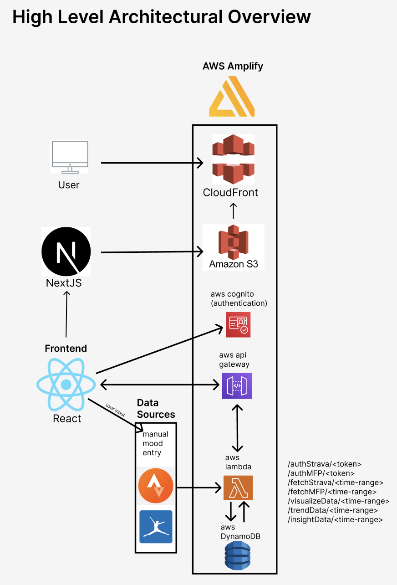

## ATHLEAT

* [Final Presentation](https://www.youtube.com/watch?v=kohhrJV1l6A)
* [Initial Vision](https://youtu.be/kohhrJV1l6A)

## Architecture



_Note: The web hosting via S3 and Cloudfront is not live, project can only be launched locally via the following steps..._

## Getting Started

First, run the development server:

```bash
npm run dev
# or
yarn dev
# or
pnpm dev
# or
bun dev
```

Open [http://localhost:3001](http://localhost:3001) with your browser to see the result.

